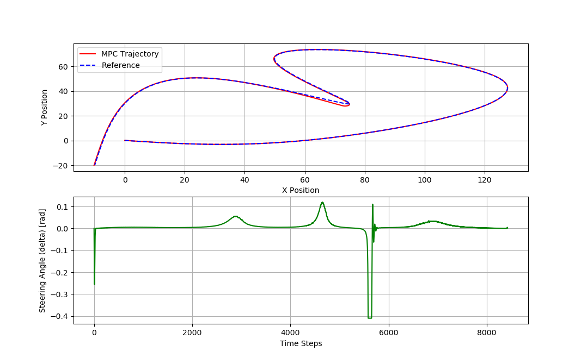
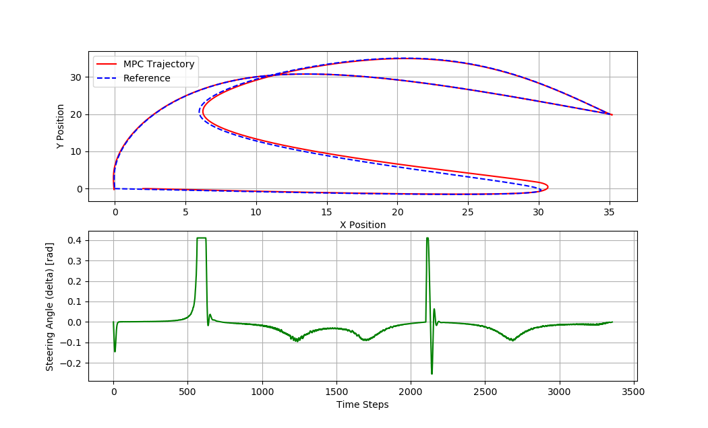

# MPC_BicycleModel
This repository contains cpp model predictive controller (MPC) for controling a vehicle based on bicycle model


## Dependencies
- [boost v1.58](https://www.boost.org/users/history/version_1_58_0.html)
- [osqp](http://osqp.readthedocs.io/en/latest/index.html)
- [osqp-eigen](https://github.com/robotology/osqp-eigen)
- [Eigen3](http://eigen.tuxfamily.org/index.php?title=Main_Page)
- [cmake v3.0+](https://cmake.org/)
- [matplotlibcpp](git clone https://github.com/lava/matplotlib-cpp.git).


## Building
### Linux
```sh
git clone https://github.com/robotology/osqp-eigen.git
cd osqp-eigen
mkdir build
cd build
cmake -DCMAKE_INSTALL_PREFIX:PATH=/user/local/osqp-eigen ../
make
make install
echo 'export OsqpEigen_DIR=/user/local/osqp-eigen' >> ~/.bashrc
source ~/.bashrc

git clone https://github.com/M2219/MPC_BicycleModel
cd MPC_BicycleModel 
mkdir build && cd build
cmake ../
make
```

## Running an example: 
Choose the target course in the main.cpp and adjust the parameters in mpc_controller.hpp (Current values are set for Hunter v2 mobile robot)

```sh
./mpc
```

## Results
### 


### 



## ROS

The ROS node will be provided in the following page
https://github.com/M2219/hunter2_proj

